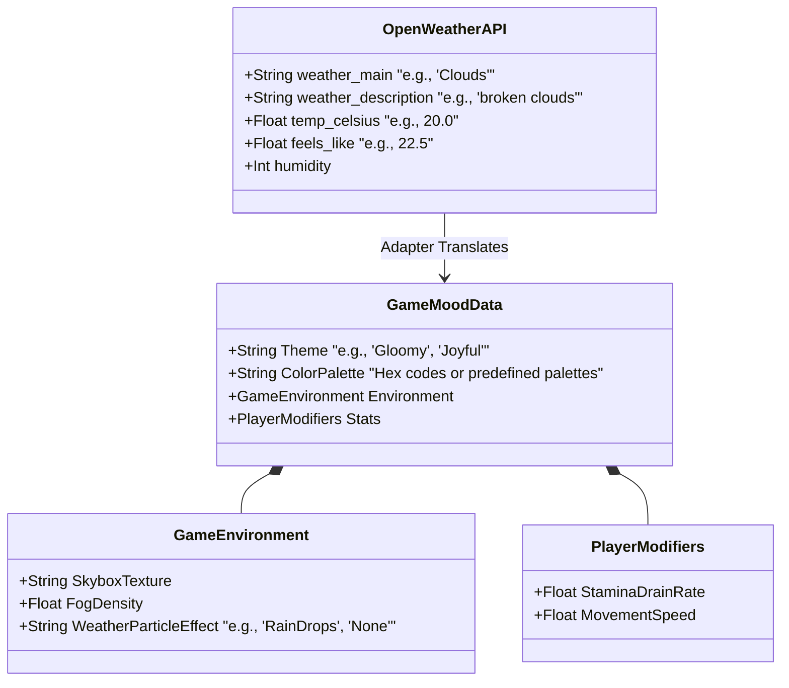
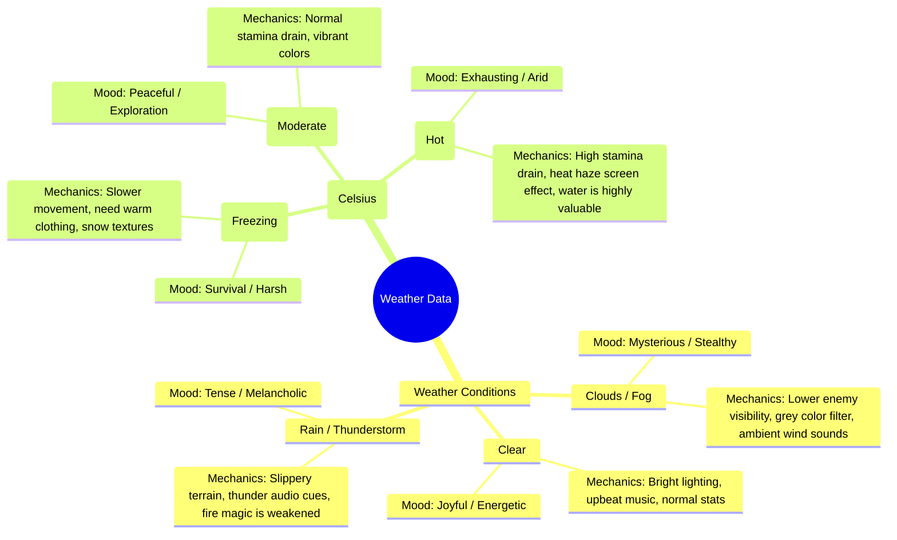

## Data Mapping 

Here is a visual representation of how the raw data structures translate into the domain models for a game.

## Concept Mapping 

Concepts mapping about how specific data points could affect the actual gameplay

