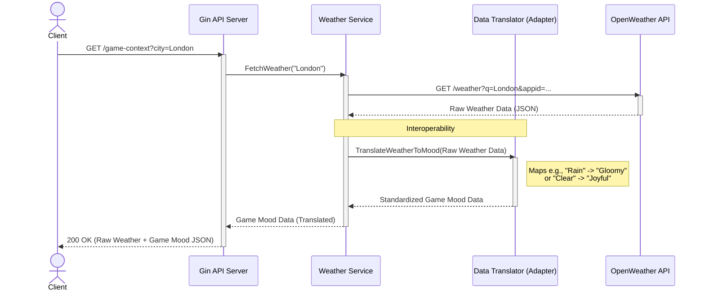

## Sequence Diagram

The following sequence diagram illustrates the workflow where a client requests a game mood, and the system fetches data from OpenWeatherMap, then translates it into a standardized format.

